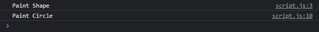

# Super Method

---

## Super Method

- Selain digunakan untuk memanggil constructor milih parent class, kata kunci super juga bisa digunakan untuk mengakses method parent class
- Caranya bisa menggunakan super titik nama function nya
- Dengan kata lain, super sebenarnya adalah reference ke parent prototype, mirip seperti __proto__

---

## Kode : Super Method

```js
class Shape {
    paint() {
        console.log("Paint Shape");
    }
}

class Circle extends Shape {
    paint() {
        super.paint();
        console.log("Paint Circle");
    }
}

const circle = new Circle();
circle.paint()
```

**Hasil :**

