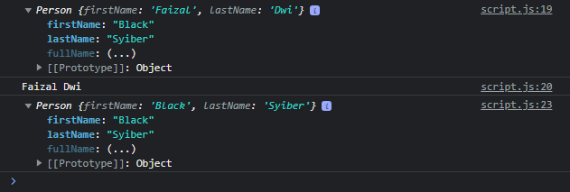

# Getter dan Setter di Class

---

## Getter dan Setter di Class

- Class juga mendukung pembuatan getter dan setter
- Perlu diingat, getter dan setter ini akan berada di prototype, bukan di instance object

---

## Kode : Getter dan Setter

```js
class Person {
    constructor(firstName, lastName) {
        this.firstName = firstName;
        this.lastName = lastName;
    }

    get fullName() {
        return `${this.firstName} ${this.lastName}`;
    }

    set fullName(value) {
        const result = value.split(" ");
        this.firstName = result[0];
        this.lastName = result[1];
    }
}

const faizal = new Person("Faizal", "Dwi");
console.log(faizal);
console.log(faizal.fullName);

faizal.fullName = "Black Syiber";
console.log(faizal);
```

**Hasil :**

