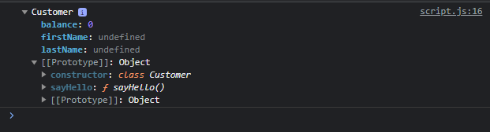
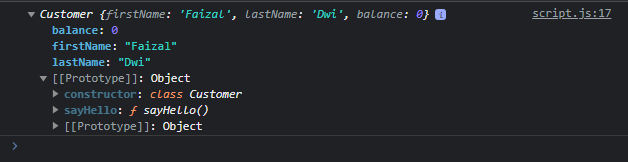

# Public Class Field

---

## Class Field

- Biasanya, saat kita ingin menambahkan field (property yang berisi value), kita biasanya tambahkan di constructor
- Namun, ada proposal di EcmaScript yang mengajukan pembuatan public class field ditempatkan diluar constructor, selevel dengan penempatan method
- Proposal ini masih belum final, namun beberapa browser sudah mendukung nya
- https://github.com/tc39/proposal-class-fields

---

## Public Class Field

- Dalam proposal tersebut juga disebutkan bahwa EcmaScript akan mendukung access modifier public dan private
- Public artinya bisa diakses dari luar class, dan private hanya bisa diakses dari dalam class saja
- Private class field akan kita bahas di chapter selanjutnya
- Untuk membuat public class field, kita bisa langsung buat nama field dengan value nya selevel dengan method
- Jika kita tidak memasukkan value ke dalam field tersebut, artinya field tersebut memiliki value undefined

---

## Kode : Public Class Field

```js
class Customer {
    firstName;
    lastName;
    balance = 0;

    constructor() {

    }

    sayHello() {

    }
}

const faizal = new Customer();
console.log(faizal);
```

**Hasil :**



---

## Kode : Public Class Field dan Constructor

```js
class Customer {
    firstName;
    lastName;
    balance = 0;

    constructor(firstName, lastName) {
        this.firstName = firstName;
        this.lastName = lastName;
    }

    sayHello() {

    }
}

const faizal = new Customer("Faizal", "Dwi");
console.log(faizal);
```

**Hasil :**

