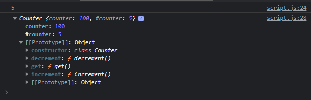
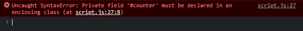

# Private Class Field

---

## Private Class Field

- Secara default, saat kita menambahkan field, maka field tersebut bisa diakses dari manapun
- Jika kita ingin membuat field yang bersifat private (hanya bisa diakses di dalam class), kita bisa menggunakan tanda # sebelum nama field nya
- Ini dinamakan private class field, dan hanya bisa diakses dari dalam class saja

---

## Kode : Private Class Field

```js
class Counter {
    #counter = 0;

    increment() {
        this.#counter++;
    }

    decrement() {
        this.#counter--;
    }

    get() {
        return this.#counter;
    }
}

const counter = new Counter();
counter.increment();
counter.increment();
counter.increment();
counter.increment();
counter.increment();

console.log(counter.get());

counter.counter = 100;

console.log(counter);
```

**Hasil :**



jika kita merubah paksa, maka akan error

```js
counter.#counter = 100
```

```js
class Counter {
    #counter = 0;

    increment() {
        this.#counter++;
    }

    decrement() {
        this.#counter--;
    }

    get() {
        return this.#counter;
    }
}

const counter = new Counter();
counter.increment();
counter.increment();
counter.increment();
counter.increment();
counter.increment();

console.log(counter.get());

counter.counter = 100;
counter.#counter = 100;

console.log(counter);
```

**Hasil :**



