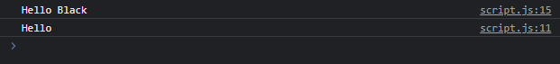
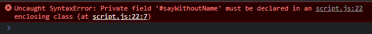

# Private Method

---

## Private Method

- Sama seperti field, terdapat proposal juga untuk menambah fitur private method di EcmaScript
- Dengan demikian, access modifier private juga bisa digunakan di method
- Caranya sama, dengan menambahkan tanda # diawal method, maka secara otomatis method tersebut adalah private
- Ingat fitur ini masih dalam tahapan, belum benar-benar menjadi standard EcmaScript, jadi mungkin tidak semua browser mendukung fitur ini
- https://github.com/tc39/proposal-private-methods

---

## Kode : Private Method

```js
class Person {
    say(name) {
        if(name) {
            this.#sayWithName(name);
        } else {
            this.#sayWithoutName();
        }
    }

    #sayWithoutName() {
        console.log("Hello");
    }

    #sayWithName(name) {
        console.log(`Hello ${name}`);
    }
}

const faizal = new Person();
faizal.say("Black");
faizal.say();
```

**Hasil :**



---

> jika kita memaksa mengakses methodnya, maka akan error

```js
class Person {
    say(name) {
        if(name) {
            this.#sayWithName(name);
        } else {
            this.#sayWithoutName();
        }
    }

    #sayWithoutName() {
        console.log("Hello");
    }

    #sayWithName(name) {
        console.log(`Hello ${name}`);
    }
}

const faizal = new Person();
faizal.say("Black");
faizal.say();
faizal.#sayWithoutName();
```

**Hasil :**

