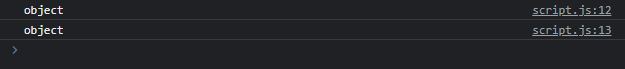
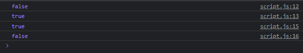
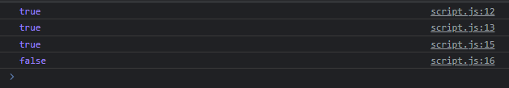

# Operator instanceof

---

## Operator instanceof

- Kadang ada kasus kita ingin mengecek apakah sebuah object merupakan instance dari class tertentu atau bukan
- Kita tidak bisa menggunakan operator typeof, karena object dari class, jika kita gunakan operator typeof, hasilnya adalah “object”
- Operator instanceof akan menghasilkan boolean, true jika benar object tersebut adalah instance object nya, atau false jika bukan

---

## Kode : Operator instanceof

jika kita menggunakan typeof

```js
class Employee {

}

class Manager {

}

const syiber = new Employee();
const faizal = new Manager();

console.log(typeof faizal);
console.log(typeof syiber);
```

**Hasil :**



---

```js
class Employee {

}

class Manager {

}

const syiber = new Employee();
const faizal = new Manager();

console.log(faizal instanceof Employee);
console.log(faizal instanceof Manager);

console.log(syiber instanceof Employee);
console.log(syiber instanceof Manager);
```

**Hasil :**



---

## Operator instanceof di Class Inheritance

- Operator instanceof mendukung class inheritance, artinya instanceof juga bisa digunakan untuk mengecek, apakah sebuah object adalah instance dari class tertentu, atau turunan dari class tertentu?

---

## Kode : Operator instanceof di Inheritance

```js
class Employee {

}

class Manager extends Employee {

}

const syiber = new Employee();
const faizal = new Manager();

console.log(faizal instanceof Employee); // true
console.log(faizal instanceof Manager); // true

console.log(syiber instanceof Employee); // true
console.log(syiber instanceof Manager); // false
```

**Hasil :**

