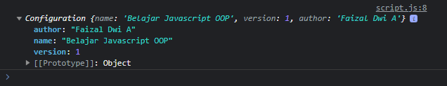
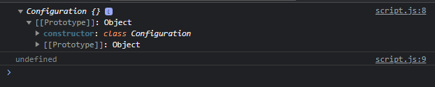
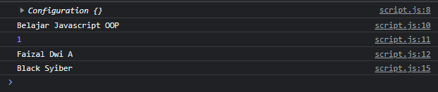

# Static Class Field

---

## Kata Kunci static

- static adalah kata kunci yang bisa kita tambahkan sebelum field atau method, biasannya ketika kita membuat field atau method, maka secara otomatis field akan menjadi property di instance object, dan method akan menjadi function di prototype
- Jika kita tambahkan static, maka hal itu tidak terjadi

---

## Static Class Field

- Jika kita tambahkan static dalam class field, secara otomatis field tersebut bukan lagi milik instance object, melainkan milik class nya itu sendiri
- Biasanya static digunakan jika kita ingin membuat utility field atau function
- Cara mengakses static class field pun tidak lagi lewat object, melainkan lewat class nya
- Static class field bisa diartikan sifatnya global, tidak peduli diakses dimana atau siapa yang mengakses, hasilnya akan sama

---

## Kode : Static Class Field

### tanpa static

```js
class Configuration {
    name = "Belajar Javascript OOP";
    version = 1.0;
    author = "Faizal Dwi A";
}

const config = new Configuration();
console.log(config);
```

**Hasil :**



Menggunakan static

```js
class Configuration {
    static name = "Belajar Javascript OOP";
    static version = 1.0;
    static author = "Faizal Dwi A";
}

const config = new Configuration();
console.log(config);
console.log(config.name);
```

**Hasil :**



---

## Kode : Mengakses Static Class Field

```js
class Configuration {
    static name = "Belajar Javascript OOP";
    static version = 1.0;
    static author = "Faizal Dwi A";
}

const config = new Configuration();
console.log(config);

console.log(Configuration.name);
console.log(Configuration.version);
console.log(Configuration.author);

Configuration.author = "Black Syiber";
console.log(Configuration.author);
```

**Hasil :**

