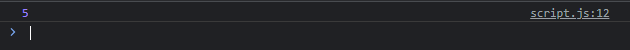

# Static Method

---

## Static Method

- Kata kunci static juga tidak hanya bisa ditambahkan di field, tapi juga di method
- Jika kita tambahkan di method, artinya method tersebut jadi milik class nya, bukan prototype
- Dan untuk mengakses method tersebut, kita juga bisa lakukan seperti mengakses static class field

---

## Kode : Static Method

```js
class MathUtil {
    static sum(...numbers) {
        let total = 0;
        for(const number of numbers) {
            total += number;
        }
        return total;
    }
}

const result = MathUtil.sum(1, 1, 1, 1, 1);
console.log(result);
```

**Hasil :**

