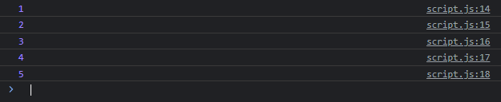

# Error Handling

---

## Error Handling

- Saat terjadi error di kode program JavaScript, kadang kita tidak ingin program kita berhenti
- Di JavaScript, kita bisa menangkap jika terjadi error
- Kita bisa menggunakan try catch statement untuk menangkap error
- Pada block try, kita akan mencoba mengakses kode program yang bisa menyebabkan error, dan jika terjadi error, block try akan berhenti dan otomatis masuk ke block catch
- Jika tidak terjadi error, block catch tidak akan dieksekusi

---

## Kode : Error Handling

```js
class MathUtil {
    static sum(...numbers) {
        if(numbers.length === 0) {
            // const error = new Error("Total parameter harusn lebih dari 0");
            // throw error;
            throw new Error("Total parameter harus lebih dari 0");
        }

        let total = 0;
        for(const number of numbers) {
            total += number;
        }
        return total;
    }
}

try {
    console.log(MathUtil.sum());
    console.log("Faizal");
} catch (error) {
    console.log(`Terjadi error : ${error.message}`);
}

console.log("Syiber");
```

**Hasil :**


- jika terjadi error maka jalankan perintah yang ada di block catch
- jika tidak terjadi error maka jalankan perintah yang ada di block try
- dan program tidak akan berhenti
  
---

## Kata Kunci finally

- Kadang kita ingin melakukan sesuatu entah itu terjadi error ataupun tidak
- Dalam try catch, kita bisa menambahkan block finally
- Block finally ini akan selalu dieksekusi setelah try catch selesai, entah terjadi error atau tidak, block finally akan selalu dieksekusi

---

## Kode : Kata Kunci finally

```js
class MathUtil {
    static sum(...numbers) {
        if(numbers.length === 0) {
            // const error = new Error("Total parameter harusn lebih dari 0");
            // throw error;
            throw new Error("Total parameter harus lebih dari 0");
        }

        let total = 0;
        for(const number of numbers) {
            total += number;
        }
        return total;
    }
}

try {
    console.log(MathUtil.sum());
    console.log("Faizal");
} catch (error) {
    console.log(`Terjadi error : ${error.message}`);
} finally {
    console.log("Program selesai");
}

console.log("Syiber");
```

**Hasil :**


---

## Try Finally

- Kata kunci finally juga bisa digunakan tanpa perlu menggunakan catch
- Biasanya ini digunakan dalam kasus tertentu

---

## Kode : Try Finally

```js
class Counter {
    #counter = 1;

    next() {
        try {
            return this.#counter;
        } finally {
            this.#counter++;
        }
    }
}

const counter = new Counter();
console.log(counter.next());
console.log(counter.next());
console.log(counter.next());
console.log(counter.next());
console.log(counter.next());
```

**Hasil :**

