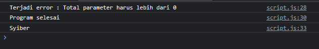
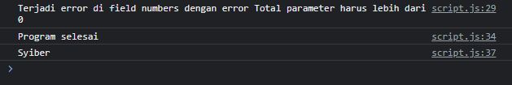

# Membuat Class Error Manual

---

## Membuat Class Error Manual

- Walaupun JavaScript sudah memiliki standard class Error
- Namun alangkah baiknya, kita membedakan tiap jenis error
- Untuk membuat error sendiri secara manual sangatlah mudah, cukup membuat class turunan dari class Error
- Dan jangan lupa tambahkan parameter message, agar bisa dikirimkan ke parameter di constructor class Error

---

## Kode : Class ValidationError 

```js
class ValidationError extends Error {
    constructor(message, field) {
        super(message);
        this.field = field;
    }
}
```

---

## Kode : Menggunakan ValidationError

```js
class ValidationError extends Error {
    constructor(message, field) {
        super(message);
        this.field = field;
    }
}

class MathUtil {
    static sum(...numbers) {
        if(numbers.length === 0) {
            // const error = new Error("Total parameter harusn lebih dari 0");
            // throw error;
            throw new ValidationError("Total parameter harus lebih dari 0");
        }

        let total = 0;
        for(const number of numbers) {
            total += number;
        }
        return total;
    }
}

try {
    console.log(MathUtil.sum());
    console.log("Faizal");
} catch (error) {
    console.log(`Terjadi error : ${error.message}`);
} finally {
    console.log("Program selesai");
}

console.log("Syiber");
```

**Hasil :**



- hasilnya sama saja
- alasan kenapa kita membuat error manual : 

### bisa menyisipkan informasi tambahan

```js
class ValidationError extends Error {
    constructor(message, field) {
        super(message);
        this.field = field;
    }
}

class MathUtil {
    static sum(...numbers) {
        if(numbers.length === 0) {
            // const error = new Error("Total parameter harusn lebih dari 0");
            // throw error;
            throw new ValidationError("Total parameter harus lebih dari 0", "numbers");
        }

        let total = 0;
        for(const number of numbers) {
            total += number;
        }
        return total;
    }
}

try {
    console.log(MathUtil.sum());
    console.log("Faizal");
} catch (error) {
    if(error instanceof ValidationError) {
    console.log(`Terjadi error di field ${error.field} dengan error ${error.message}`);
    } else {
        console.log(`Terjadi error : ${error.message}`);
    }
} finally {
    console.log("Program selesai");
}

console.log("Syiber");
```

**Hasil :**

