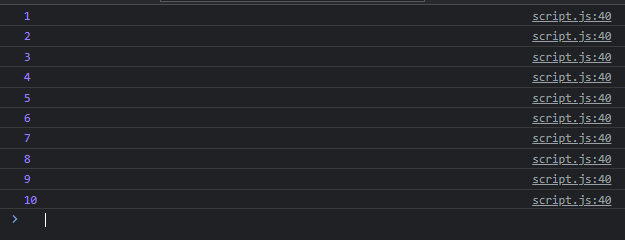

# Iterable dan Iterator

---

## Iterable dan Iterator

- Salah satu fitur terbaru di ES6 adalah iterable
- Iterable adalah spesial object yang memiliki standarisasi
- Dengan mengikuti standarisasi Iterable, secara otomatis kita bisa melakukan iterasi terdapat data tersebut dengan menggunakan perulangan for...of
- Contoh yang sudah mengikuti standarisasi Iterable adalah string, Array, Object, dan lain-lain

---

## Kode : Kontrak Iterable (dalam TypeScript)

```js
interface Iterable<T> {
    [Symbol.iterator](): Iterator<T>;
}
```

---

## Kode : Kontrak Iterator (dalam TypeScript)

```js
interface Iterator<T, TReturn = any, TNext = undefined> {
    // NOTE: 'next' is defined using a tuple to ensure we report the correct
    next(...args: [] | [TNext]): IteratorResult<T, TReturn>;
    return?(value?: TReturn): IteratorResult<T, TReturn>;
    throw?(e?: any): IteratorResult<T, TReturn>;
}
```

---

## Kontrak : IteratorResult (dalam TypeScript)

```js
interface IteratorYieldResult<TYield> {
    done?: false;
    value: TYield;
}

interface IteratorReturnResult<TReturn> {
    done: true;
    value: TReturn;
}

type IteratorResult<T, TReturn = any> = IteratorYieldResult<T> | IteratorReturnResult<TReturn>;
```

---

## Cara Kerja Iterable dan Iterator

- Jika kita mengikuti kontrak Iterable, maka object yang kita buat akan bisa dilakukan iterasi menggunakan for...of
- Setiap kita melakukan perulangan, object Iterator akan dibuat
- Hal ini menjadi aman jika kita melakukan iterasi berulang-ulang, karena Iterator baru akan dibuat terus menerus

---

## Kode : Membuat Counter Iterator Result

```js
class CounterIteratorResult {
    constructor(value, done) {
        this.done = done;
        this.value = value;
    }
}
```

---

## Kode : Membuat Counter Iterator

```js
class CounterIterator {
    constructor(value, max) {
        this.value = value;
        this.max = max;
    }

    next() {
        try {
            if(this.value > this.max) {
                return new CounterIteratorResult(this.value, true);
            } else {
                return new CounterIteratorResult(this.value, false);
            }
        } finally {
            this.value++;
        }
    }
}
```

---

## Kode : Membuat Counter Iterable

```js
class Counter {
    constructor(value, max) {
        this.value = value;
        this.max = max;
    }

    [Symbol.iterator]() {
        return new CounterIterator(this.value, this.max);
    }
}
```

---

## Kode : Menggunakan Counter Iterable

```js
class CounterIteratorResult {
    constructor(value, done) {
        this.done = done;
        this.value = value;
    }
}

class CounterIterator {
    constructor(value, max) {
        this.value = value;
        this.max = max;
    }

    next() {
        try {
            if(this.value > this.max) {
                return new CounterIteratorResult(this.value, true);
            } else {
                return new CounterIteratorResult(this.value, false);
            }
        } finally {
            this.value++;
        }
    }
}

class Counter {
    constructor(value, max) {
        this.value = value;
        this.max = max;
    }

    [Symbol.iterator]() {
        return new CounterIterator(this.value, this.max);
    }
}

const counter = new Counter(1, 10);
for (const element of counter) {
    console.log(element);
}
```

**Hasil :**

