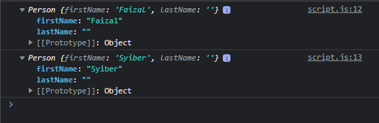

# Property di Constructor Function

---

## Property di Constructor Function

- Sebenarnya **setelah** kita membuat object, kita bisa dengan mudah **menambahkan property** ke dalam object tersebut hanya dengan menggunakan **nama variable nya**, diikuti **tanda titik dan nama property**
- Namun **jika seperti itu**, alhasil, constructor function yang sudah kita buat **tidak terlalu berguna**, karena property nya hanya ada di object yang kita tambahkan property
- Untuk **menambahkan property** di dalam semua object yang dibuat dari constructor function, kita bisa **menggunakan kata kunci this** lalu diikuti dengan nama property nya

---

## Kode : Property di Constructor Function

```js
function Person() {
    this.firstName = "",
    this.lastName = ""
}

const faizal = new Person();
faizal.firstName = "Faizal"; // seperti ini bisa cuma tidak semua object dapat property ini

const syiber = new Person();
syiber.firstName = "Syiber";

console.log(faizal);
console.log(syiber);
```

**Hasil :**

