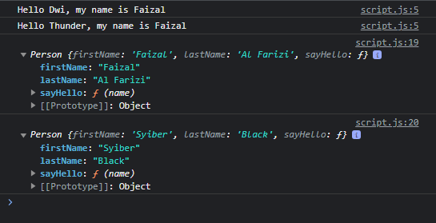

# Method di Constructor Function

---

## Method di Constructor Function

- Sama seperti pada **tipe data object** biasanya, kita juga bisa **menambahkan method** di dalam **constructor function**
- Jika kita tambahkan method di constructor function, secara otomatis object yang dibuat akan memiliki method tersebut

---

## Kode : Method di Constructor Function

```js
function Person() {
    this.firstName = "";
    this.lastName = "";
    this.sayHello = function(name) {
        console.log(`Hello ${name}, my name is ${this.firstName}`);
    }
}

const faizal = new Person();
faizal.firstName = "Faizal"; // seperti ini bisa cuma tidak semua object dapat property ini
faizal.lastName = "Al Farizi";
faizal.sayHello("Dwi");

const syiber = new Person();
syiber.firstName = "Syiber";
syiber.lastName = "Black";
faizal.sayHello("Thunder");

console.log(faizal);
console.log(syiber);
```

**Hasil :**

