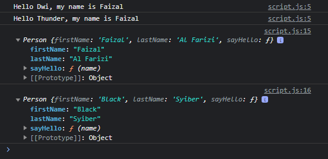

# Parameter di Constructor Function

---

## Parameter di Constructor Function

- Karena dalam JavaScript, **class** adalah **berbentuk function**, jadi secara default, function tersebut bisa memiliki parameter
- Constructor function sama seperti function biasanya, **bisa memiliki parameter**, hal ini membuat ketika kita membuat object, kita bisa mengirim langsung data lewat parameter di constructor function tersebut

---

## Kode : Parameter di Constructor Function

```js
function Person(firstName, lastName) {
    this.firstName = firstName;
    this.lastName = lastName;
    this.sayHello = function(name) {
        console.log(`Hello ${name}, my name is ${this.firstName}`);
    }
}

const faizal = new Person("Faizal", "Al Farizi");
faizal.sayHello("Dwi");

const syiber = new Person("Black", "Syiber");
faizal.sayHello("Thunder");

console.log(faizal);
console.log(syiber);
```

**Hasil :**

