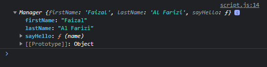

# Constructor Inheritance

---

## Constructor Inheritance

- Dalam constructor kita biasanya membuat property baik itu berisi **value ataupun function**
- Di dalam constructor, kita **bisa memanggil constructor lain**, dengan begitu kita bisa mewarisi semua property yang dibuat di constructor lain tersebut
- Untuk memanggil constructor lain, kita bisa menggunakan **NamaCAnstructor.call(this, parameter)**

---

## Kode : Constructor Inheritance

```js
function Employee(firstName) {
    this.firstName = firstName;
    this.sayHello = function(name) {
        console.log(`Hi ${name}, my name is ${this.firstName}`);
    }
}

function Manager(firstName, lastName){
    Employee.call(this, firstName);
    this.lastName = lastName;
}

const faizal = new Manager("Faizal", "Al Farizi");
console.log(faizal);
```

**Hasil :**

