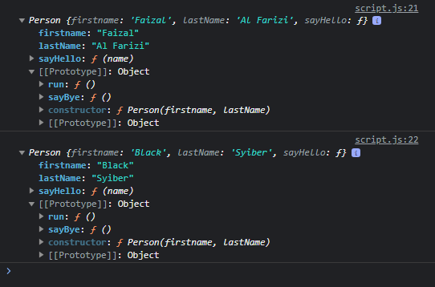

# Prototype

---

## Prototype

- JavaScript sebelumnya dikenal dengan **pemrograman berbasis prototype**
- Memang agak sedikit **membingungkan**, dan tidak dipungkiri, **banyak sekali yang bingung** dengan konsep prototype di JavaScript
- Pada chapter ini, kita akan bahas tentang konsep prototype

---

## Prototype Inheritance

- Saat kita membuat object dari constructor function, object tersebut disebut **instance**, semua property (baik itu value atau method), akan berada **di dalam** instance object nya
- Setiap kita membuat sebuah constructor function, maka secara otomatis akan dibuatkan prototype nya, misal ketika kita membuat **constructor function Person**, maka akan ada **Person.prototype**
- Saat kita membuat sebuah object instance, secara otomatis object tersebut adalah turunan dari Constructor.prototype nya
- Untuk mengakses prototype milih sebuah instance, kita bisa menggunakan **__proto__**

---

## Kode : Object Instance

```js
function Person(firstname, lastName) {
    this.firstname = firstname;
    this.lastName = lastName;
    this.sayHello = function(name) {
        console.log(`Hello ${name}, my name is ${this.firstname}`);
    }
}

const faizal = new Person("Faizal", "Al Farizi");
const syiber = new Person("Black", "Syiber");

console.log(faizal);
console.log(syiber);
```

**Hasil :**


---

## Console : Object Instance


---

## DiagramPrototype


---

## Console : Object Instance Inheritance


---

## Menambah Property ke Prototype

- Property mirip object, dimana kita bisa menambah property baik itu value ataupun method
- Saat kita menambah sebuah property ke Prototype, secara otomatis, semua object instance yang turunan dari prototype tersebut akan memiliki property tersebut

---

## Kode : Menambah Property ke Instance Object

```js
function Person(firstname, lastName) {
    this.firstname = firstname;
    this.lastName = lastName;
    this.sayHello = function(name) {
        console.log(`Hello ${name}, my name is ${this.firstname}`);
    }
}

const faizal = new Person("Faizal", "Al Farizi");
faizal.sayBye = function() {
    console.log("Good Bye");
}

const syiber = new Person("Black", "Syiber");

console.log(faizal);
console.log(syiber);
```

**Hasil :**


---

## Kode : Menambahkan Property ke Prototype

```js
function Person(firstname, lastName) {
    this.firstname = firstname;
    this.lastName = lastName;
    this.sayHello = function(name) {
        console.log(`Hello ${name}, my name is ${this.firstname}`);
    }
}

Person.prototype.sayBye = function() {
    console.log("Good Bye");
}

Person.prototype.run = function() {
    console.log(`${this.firstname} is running`);
}

const faizal = new Person("Faizal", "Al Farizi");

const syiber = new Person("Black", "Syiber");

console.log(faizal);
console.log(syiber);
```

**Hasil :**



---

## Cara Kerja Prototype Inheritance

- Bagaimana bisa property di prototype diakses dari object instance?
- Ketika kita mengakses property di object instance, pertama akan di cek apakah di object tersebut terdapat property tersebut atau tidak, jika tidak, maka akan di cek di __proto__ (prototype) nya, jika masih tidak ada, akan di cek lagi di __proto__ (prototype) yang lebih tinggi, begitu seterusnya, sampai berakhir di Object Prototype

```js
function Person(firstname, lastName) {
    this.firstname = firstname;
    this.lastName = lastName;
    this.sayHello = function(name) {
        console.log(`Hello ${name}, my name is ${this.firstname}`);
    }
}

Person.prototype.sayBye = function() { // ini tidak ditampilkan karena kalah sama dengan yang diinisialisasi faizal.sayBye
    console.log("Good Bye");
}

Person.prototype.run = function() {
    console.log(`${this.firstname} is running`);
}

const faizal = new Person("Faizal", "Al Farizi");
faizal.sayBye = function() { // ini yang akan ditampilkan
    console.log("Sampai Jumpa");
}

const syiber = new Person("Black", "Syiber");

console.log(faizal);
console.log(syiber);

faizal.sayBye();
faizal.run();
```

**Hasil :**


---

## Console : Prototype Inheritance

