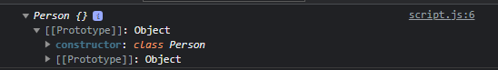

# Kata Kunci Class

---

## Membuat Class

- Sejak EcmaScript versi 6, diperkenalkan kata kunci baru, yaitu class, ini merupakan kata kunci yang digunakan untuk membuat class di JavaScript
- Dengan kata kunci class, kita tidak perlu lagi menggunakan constructor function untuk membuat class

---

## Kode : Membuat Class

```js
class Person {
    
}

const faizal = new Person();
console.log(faizal);
```

**Hasil :**



